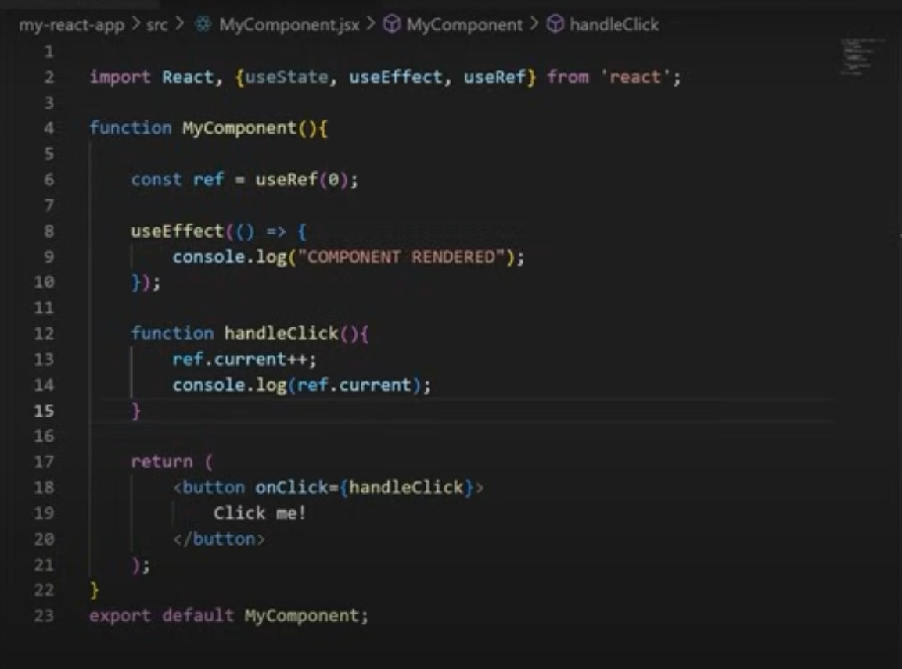

# useRef() Hook

useState() = Re-renders the component when the state value changes.

useRef() = "use Reference" Does not cause re-renders when its value changes. but you don't want that information to trigger new renders

### Uses of useRef()

1. Accessing/Interacting with DOM elements
2. Handling Focus, Animations and Transitions
3. Managing timers and intervals

useRef() returns an object, an object that has one property of `current`

### Personal notes

1. `useref` can also be assigned to html elements
2. the `ref` attribute of the `input` element is used to create references to elements. You can point a ref to any value. However, the most common use case for a ref is to access a DOM element
